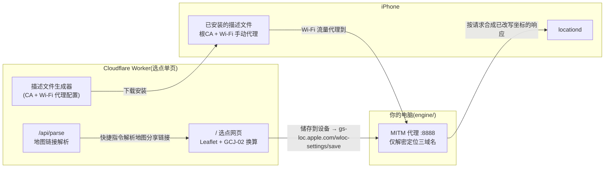

# wloc-page — WLOC 免客户端单页(证书 + 描述文件,不装任何代理 App)

[](https://deploy.workers.cloudflare.com/?url=https://github.com/Amamiyashi0n/wwwloc)

一个 **纯网页** 的 Apple 网络定位修改工具:在部署好的单页上选点,手机装一份 **证书 + 描述文件** 即可生效——**不需要安装 Surge / Quantumult X / Loon / Stash / Shadowrocket 等任何代理客户端,也不需要任何 IPA**。

改写引擎是本仓库的 [`engine/`](engine/README.md) 目录,跑在**你自己的电脑**上(Node ≥ 18,零依赖,无需 iOS 开发者账号);选点网页与地图解析跑在 Cloudflare Worker 上。两者配合,没有第三方参与。

> [!TIP]
> **一键部署**:点击上方按钮,登录 Cloudflare 并授权 GitHub,即可把这个仓库部署成你的 Worker。部署完成后打开分配给你的 `*.workers.dev` 地址就是选点单页,里面已内置描述文件生成器,零配置可用。

基于 [xepes0/wloc](https://github.com/xepes0/wloc)([Yu9191/wloc](https://github.com/Yu9191/wloc) 的社区恢复版)整理,沿用其 AGPL-3.0 许可证;来源与完整性记录见 [NOTICE.md](NOTICE.md)。

## 怎么用(三步)

### 1. 电脑上跑引擎

```sh
cd engine
bash tools/make-certs.sh        # 首次生成证书(需 openssl)
cp config.example.json config.json
#   编辑 config.json: serverHost = 电脑局域网 IP;ssids = 你的 Wi-Fi 名(可带密码)
npm start
```

引擎监听两个端口:代理 `8888`(仅解密 `gs-loc.apple.com` / `gs-loc-cn.apple.com` / `gsp-ssl.ls.apple.com`,其余流量盲隧道)、管理页 `18080`(状态、`/ca.cer` 证书下载)。

### 2. 手机上装描述文件

手机与电脑连同一 Wi-Fi,用 Safari 打开部署后的选点页 → 页面底部「免客户端模式」卡片 → 填入电脑 IP、Wi-Fi 名称 → **生成并下载描述文件** → 安装。

**根证书由站点自动载入**(页面显示 SHA-256 指纹),不需要手动传文件。

然后**必须**再走一步:设置 → 通用 → 关于本机 → **证书信任设置** → 对 `selfhost-wloc Root CA` 打开**完全信任**。

> [!IMPORTANT]
> **装描述文件 ≠ 完全信任证书。** 漏掉这一步的典型现象是「网络连接已中断」「保存成功但地图不变」。
>
> 站点分发的证书来自仓库 `public/ca.cer`(只有证书、没有私钥;私钥始终在引擎所在机器)。它是 `engine/tools/make-certs.sh` 自动同步的——**重新生成证书后必须重跑 `npm run configure` 并提交**,否则站点发出的是旧证书,手机将无法与引擎握手。页面上的指纹可用来核对。

### 3. 选点并刷新定位

在同一个页面上选好位置 → 点「储存到设备」(该请求经引擎代理写入坐标) → 然后必须按顺序刷新一次定位:

**关闭定位服务 → 打开飞行模式(确认 Wi-Fi/蓝牙也关)→ 等 10 秒 → 关闭飞行模式 → 等网络恢复 → 最后重新开启定位服务**

之后打开地图看蓝点。完整图文步骤与排错见 [docs/USAGE.md](docs/USAGE.md)。

## 为什么不需要代理客户端



传统做法要把 MITM 引擎装进代理客户端(那些 App 才有脚本引擎);这里把同一件事交给 **系统描述文件里的 Wi-Fi 手动代理 + 你电脑上的引擎**,所以手机上什么 App 都不用装。

## 部署

**方式 A:一键部署** —— 点顶部「Deploy to Cloudflare」按钮,授权后即完成。注意:这是**一次性**部署,之后仓库更新不会自动上线;要自动,见下面的「推送到 main 即自动部署」。

**方式 B:自动部署(推荐)** —— 推送到 `main` 就自动上线,不用每次点。仓库已内置 [`.github/workflows/deploy.yml`](.github/workflows/deploy.yml),你只需在 GitHub 仓库 Settings → Secrets and variables → Actions 添加两个 secret(一次性):

| Secret | 取值 |
| --- | --- |
| `CLOUDFLARE_API_TOKEN` | Cloudflare 控制台 → My Profile → API Tokens → Create Token → 模板 **Edit Cloudflare Workers**,或自定义权限 `Workers Scripts:Edit` + `Account Settings:Read` |
| `CLOUDFLARE_ACCOUNT_ID` | 控制台 Workers 概览页右侧的 Account ID |

配好后每次 `git push`(推到 main)会自动:装依赖 → 校验生成物与上游完整性 → 跑全部测试 → `wrangler deploy --minify`。**校验不通过就不会部署**。未配置 secret 时工作流只做校验并给一条警告,不会报红。

> [!NOTE]
> 也可以在 Cloudflare 控制台用 **Workers Builds** 的 Git 连接实现同样的效果(不需要 GitHub secret)。两条路径**选一条即可**,同时开启会导致同一提交被部署两次。

**方式 C:本地部署**(需要 Node ≥ 22):

```sh
npm ci
npx wrangler login
npm run deploy          # 部署到 wwwloc-page(名字见 wrangler.jsonc)
```

> [!IMPORTANT]
> `wrangler.jsonc` 里的 `name` 必须与你已存在的 Worker 同名(当前为 `wwwloc-page`)。改了名字会**另建一个 Worker**,旧域名不再更新。`workers_dev: true` 表示默认开启 `*.workers.dev` 域名;若绑定了自定义域,可改为 `false` 只走自定义域。

部署后同一域名下提供:

| 路径 | 用途 |
| --- | --- |
| `/` | 选点单页(六种图源、收藏、经纬度/地图链接输入、免客户端模式描述文件生成器) |
| `/api/parse?u=<链接>&format=json` | 地图链接解析(Apple/Google/高德/百度,自动 GCJ-02/BD-09 → WGS-84),供快捷指令调用 |
| `/wloc.js`、`/wloc-settings.js` | 上游代理脚本(模块模式遗留路由,免客户端模式用不到) |
| `/modules/wloc.*` | 五种客户端模块订阅(模块模式遗留路由,可选) |

## 适用范围与限制(请先读)

> [!IMPORTANT]
> - 只修改 Apple **Wi-Fi / 基站网络定位**的 HTTPS 响应,**不是 GPS 硬件模拟**;有真实 GPS 信号时系统会用 GPS 覆盖网络定位。
> - **仅 Wi-Fi 生效**:代理写在描述文件的 Wi-Fi 配置里,蜂窝网络不走,出门即失效。
> - **iOS 27 正式版不支持**:苹果已封堵该 MITM 链路(beta 6 起有 TLS 限制),任何路线都无效。
> - **核心假设尚未真机验证**:iOS 的 `locationd` 是否遵循 Wi-Fi 手动代理。装好后看引擎日志是否出现 `[proxy] MITM gs-loc`,若始终没有请求,说明 iOS 不走这条代理,此方案在你的系统上不成立(那就只能用客户端模块或 `wloc8` App 路线)。
> - 仅用于**自己拥有或已获授权**的设备、安全研究与 QA 场景复现。

## 安全红线

- `engine/certs/` 里的 **CA 私钥只留在你电脑上**;不进 git(已在 .gitignore),不要外发。
- **描述文件只给自己装**。它会把 Wi-Fi 流量代理到你的机器,且信任你的 CA;发给别人等于让别人信任你,也可能让你承担别人的流量。
- 引擎 `8888` 端口**不要暴露到公网**(代理无鉴权,会变成开放中继)。跨网使用请自备 VPN 回家方案。
- 管理页默认只绑 `127.0.0.1`;手机要装描述文件时才临时改 `adminHost` 为 `0.0.0.0`,装完改回。
- 引擎只对三个定位域名终止 TLS(硬编码 `engine/src/proxy.js` 的 `MITM_HOSTS`),其余一律盲隧道。扩大该列表前请三思。

## 开发

```sh
npm run configure    # 由 project.config.json + templates/ 生成 modules/、src/project.js、src/assets.generated.js、docs/USAGE.md
npm run check        # 生成物一致性 + vendor 完整性 + 文档链接
npm test             # 页面/路由/解析/描述文件生成器 (node --test)
npm run build:check  # wrangler dry-run 构建,不部署
npm run dev          # 本地 wrangler dev
npm --prefix engine test   # 引擎:改写器回归 + 代理端到端 + 描述文件结构
```

仓库约定:

- `vendor/wloc.js`、`vendor/wloc-settings.js` 是上游 dist 脚本的**字节级副本**,受 `docs/upstream-integrity.json` 的 SHA-256 保护;改动须同步更新哈希,详见 [NOTICE.md](NOTICE.md)。
- `modules/`、`src/project.js`、`src/assets.generated.js`、`docs/USAGE.md` 是**生成文件**,请改 `project.config.json` / `templates/` 后重新 `npm run configure`。
- 页面内联的脚本是模板字符串,写 `\n`、`\s` 这类转义时**必须写成 `\\n`、`\\s`**;`test/profile.test.mjs` 会在假 DOM 里真跑一遍生成器并校验产出的 plist,改坏会立刻变红。

## 安全与隐私

- 生效坐标保存在**引擎侧**(`engine/state.json`),收藏保存在浏览器 localStorage;Worker 无数据库、无 KV,所有路由 `no-store`,Workers observability 默认关闭。
- 但地图瓦片、地名搜索、Leaflet CDN 与地图链接解析目标站会收到相应网络请求,不要把整条链路理解为零记录。
- `/api/parse` 会向用户提供的 URL 发起服务端请求,现有 IP 字面量/内网域名过滤不是完整 SSRF 防护,请勿把解析器原样移植到可访问内网的环境。

## 免责声明

本项目仅供授权测试、安全研究和 QA 场景复现。使用本项目即表示你理解并同意:只能测试自己拥有或已获明确授权的设备、应用、账号和网络;自行遵守所在地法律法规、平台规则与服务条款;作者不对任何滥用行为、服务违规、账号封禁、数据损失或法律后果负责。本项目按「原样」提供,不提供任何形式的担保。不要使用本项目欺骗服务、绕过规则、伪造生产环境定位数据,或在未经授权的设备和网络上使用。

## 许可证

AGPL-3.0,见 [LICENSE](LICENSE)。`vendor/` 下两份脚本与其哈希记录来自上游 Yu9191/wloc 的社区恢复版,版权归原作者及贡献者所有,见 [NOTICE.md](NOTICE.md)。
