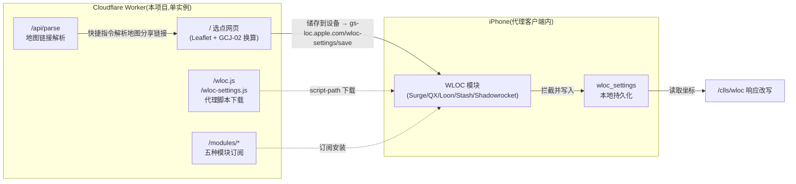

# wloc-page — WLOC 单页(选点网页 · 解析 API · 代理脚本 · 模块订阅,单 Worker 全托管)

[](https://deploy.workers.cloudflare.com/?url=https://github.com/Amamiyashi0n/wwwloc)

一个把 **选点网页、地图链接解析 API、两个 WLOC 代理脚本、五种客户端模块** 全部收进单个 Cloudflare Worker 的自包含发行版。部署之后不再依赖 GitHub Raw 或任何第三方托管 —— 代理客户端的 `script-path` 直接指向你自己的 `*.workers.dev` 域名。

> [!TIP]
> **一键部署**:点击上方按钮,登录 Cloudflare 并授权 GitHub,即可把这个仓库直接部署成你的 Worker。部署完成后模块订阅地址会**自动指向你的 workers.dev 域名**(Worker 在响应时按请求域名动态生成,零配置)。手机上打开部署后的站点,页面底部就是属于你的五种模块订阅地址。

基于 [xepes0/wloc](https://github.com/xepes0/wloc)([Yu9191/wloc](https://github.com/Yu9191/wloc) 的社区恢复版)整理,沿用其 AGPL-3.0 许可证;来源与完整性记录见 [NOTICE.md](NOTICE.md)。

## 免客户端模式(不装任何代理 App)

页面默认展示的是**免客户端模式**:手机只装一份描述文件,不装 Surge/Shadowrocket 之类的 IPA。改写引擎是本仓库的 [`engine/`](engine/README.md) 目录——跑在你自己的电脑上(Node ≥ 18,零依赖),对定位域名做 MITM:

1. 电脑:`cd engine && bash tools/make-certs.sh && cp config.example.json config.json`(填电脑局域网 IP 与 Wi-Fi 名)`&& npm start`
2. 部署后的选点页 →「免客户端模式」卡片 → 填引擎地址与 Wi-Fi 信息、载入 CA(引擎管理页 `/ca.cer`)→ 生成并安装描述文件
3. 在「证书信任设置」完全信任 → 本页选点「储存到设备」→ 按页面提示刷新定位

限制与红线:仅 Wi-Fi 生效(蜂窝不走该代理);iOS 27 正式版不支持;CA 私钥与描述文件**只给自己用**;引擎 8888 端口不要暴露公网;**iOS locationd 是否遵循 Wi-Fi 手动代理未经真机验证**——装好后看引擎日志是否出现 `MITM gs-loc`,若无请求说明此路不通。详见 [engine/README.md](engine/README.md)。

代理客户端模块(Surge/QX/Loon/Stash/Shadowrocket)路线仍然保留:Worker 的 `/modules/*` 与脚本路由继续可用,订阅地址见下方表格。

> [!IMPORTANT]
> ## ⚠️ 适用范围
>
> - 只修改 Apple **Wi-Fi / 基站网络定位**(`gs-loc.apple.com` / `gs-loc-cn.apple.com` / `gsp-ssl.ls.apple.com`)的 HTTPS 响应,**不是 GPS 硬件模拟**;有真实 GPS 信号时系统会用 GPS 覆盖网络定位。
> - 依赖代理客户端对上述域名做 HTTPS 解密(MITM)。**iOS 27 正式版已封堵该链路,按不支持处理**;beta 6 起已有 TLS 限制。
> - 仅用于**自己拥有或已获授权**的设备、安全研究与 QA 场景复现。请遵守所在地法律法规与平台条款,不要用它欺骗服务或伪造生产环境定位数据。见文末免责声明。

## 架构



一条链路的分工:

1. 浏览器打开 Worker 首页选点,「储存到设备」请求的是 `https://gs-loc.apple.com/wloc-settings/save?lon=&lat=&acc=&randomRadius=` —— 这个请求被手机上的 WLOC 模块拦截并写入客户端的 `wloc_settings`,**不经过 Worker**。
2. 系统定位服务请求 `gs-loc.apple.com/clls/wloc` 时,模块用 `/wloc.js` 改写响应里的 WiFi/基站坐标。
3. `/api/parse` 只服务于「快捷指令解析地图分享链接」和网页粘贴链接,与改写链路无关,且 `no-store`、不落日志。

## 快速部署

**方式 A:一键部署(推荐)** —— 点 README 顶部的「Deploy to Cloudflare」按钮,授权后即完成部署。模块与页面里的站点地址由 Worker 在响应时动态生成,部署完即可直接使用,无需任何配置。

**方式 B:本地部署**(需要 Node.js ≥ 22 和一个 Cloudflare 账号;想自定义 Worker 名称或把订阅表生成到 README 时用这种):

```sh
npm ci
npx wrangler login

# 1. 先部署占位站点,拿到真实 workers.dev 地址
npm run deploy

# 2. 把地址填进 project.config.json 的 site 字段
#    例如 "site": "https://wloc-page.你的子域.workers.dev"
#    然后重新生成模块与静态资源并校验
npm run configure
npm run check:release
npm test

# 3. 再次部署,最终生效
npm run deploy
```

之后所有东西都在同一个域名下:

| 路径 | 用途 |
| --- | --- |
| `/` | 选点网页(卫星/高德/OSM 等图源,收藏在浏览器 localStorage) |
| `/api/parse?u=<链接>&format=json` | 地图链接解析(Apple/Google/高德/百度,自动 GCJ-02/BD-09 → WGS-84),供快捷指令与网页调用 |
| `/wloc.js` | 定位响应改写脚本(客户端拉取) |
| `/wloc-settings.js` | 保存/查询/清除坐标脚本(客户端拉取) |
| `/modules/wloc.sgmodule` 等 | 五种客户端的模块订阅文件 |

## 安装模块

<!-- subscriptions:start -->
| 客户端 | 模块订阅地址 |
| --- | --- |
| Surge / Egern | [https://REPLACE-ME.workers.dev/modules/wloc.sgmodule](https://REPLACE-ME.workers.dev/modules/wloc.sgmodule) |
| Quantumult X | [https://REPLACE-ME.workers.dev/modules/wloc.conf](https://REPLACE-ME.workers.dev/modules/wloc.conf) |
| Loon | [https://REPLACE-ME.workers.dev/modules/wloc.lpx](https://REPLACE-ME.workers.dev/modules/wloc.lpx) |
| Stash | [https://REPLACE-ME.workers.dev/modules/wloc.stoverride](https://REPLACE-ME.workers.dev/modules/wloc.stoverride) |
| Shadowrocket | [https://REPLACE-ME.workers.dev/modules/wloc.module](https://REPLACE-ME.workers.dev/modules/wloc.module) |

选点页面:[https://REPLACE-ME.workers.dev/](https://REPLACE-ME.workers.dev/) 。

[浏览源码](https://REPLACE-ME.workers.dev/)
<!-- subscriptions:end -->

部署后先运行 `npm run configure`,上表会替换成你的真实地址。

**部署完成后,把 [docs/USAGE.md](docs/USAGE.md) 发给使用者** —— `npm run configure` 会把真实站点地址注入这份指南,里面是安装模块、信任 CA、选点、刷新定位、排错的完整操作步骤(面向使用者,不含部署细节)。

安装模块后还必须:开启客户端的 **MITM/HTTPS 解密** → 安装客户端生成的 CA 描述文件 → 在「设置 → 通用 → 关于本机 → 证书信任设置」中**完全信任**。模块安装成功不代表 WLOC 已可用,缺 MITM 或信任时典型现象是「网络连接已中断」「网页保存成功但地图不变」。

### 快捷指令

解析接口沿用上游协议,把快捷指令里的解析服务地址换成你自己的站点即可:

```text
https://<你的站点>/api/parse?format=json&u=<地图分享链接>
```

返回 `{lat, lon, name}`(JSON)或 `lat=..&lon=..`(纯文本);坐标系转换规则与上游一致,`cs=none` 可强制不转换。

## 模块参数

| 参数 | 含义 | 默认 |
| --- | --- | --- |
| longitude / latitude | 目标经纬度(未自定义时透传真实定位) | 113.94114 / 22.544577 |
| accuracy | 精度,米 | 25 |
| randomRadius | 随机扰动半径,米 | 0(关闭) |
| logLevel | 日志级别 | info |

优先级:网页/快捷指令保存的坐标 > 模块参数 > 默认值。清除保存坐标请用网页上的「清除数据」按钮。

## 开发

```sh
npm run configure    # 由 project.config.json + templates/ 重新生成 modules/、src/project.js、src/assets.generated.js
npm run check        # 生成物一致性 + vendor 完整性 + 模块内容 + 文档链接
npm test             # 解析回归 / HTTP 路由 / Stash 输出格式 (node --test)
npm run build:check  # wrangler dry-run 构建,不部署
npm run dev          # 本地 wrangler dev
```

仓库约定:

- `vendor/wloc.js`、`vendor/wloc-settings.js` 是上游 dist 脚本的**字节级副本**,受 `docs/upstream-integrity.json` 的 SHA-256 保护;改它们必须先读 [NOTICE.md](NOTICE.md) 里的说明并同步更新哈希。
- `modules/`、`src/project.js`、`src/assets.generated.js`、README 订阅区是生成文件,请改 `project.config.json` / `templates/` 后重新 `npm run configure`。
- 静态内容由 `src/assets.generated.js` 在构建期内嵌,Worker 运行时不读文件系统,全部路由 `Cache-Control: no-store`,Workers observability 默认关闭。

## 与上游 wloc_com 的差异

| | 上游(xepes0/wloc) | 本仓库 |
| --- | --- | --- |
| 脚本托管 | GitHub Raw | 同一 Worker 自托管 |
| 模块订阅 | GitHub Raw | 同一 Worker `/modules/*` |
| 选点网页 + API | Worker | Worker(同一实例) |
| 页面 save 域名 | `gs-loc.apple.com/wloc-settings/save` | 相同(被手机模块拦截,与 Worker 无关) |
| 依赖 | hono | hono(无新增) |

解析、坐标转换、模块格式与脚本逻辑均未改动;工程层(配置注入、静态托管、校验)按单 Worker 全托管重新组织。

## 安全与隐私

- 生效坐标保存在**代理客户端本地**(`wloc_settings`),收藏保存在浏览器 localStorage;Worker 无数据库、无 KV,`/api/parse` 返回 `no-store` 且 observability 关闭。
- 但地图瓦片、搜索、Leaflet CDN 与地图链接解析目标站会收到相应网络请求,不要把整条链路理解为零记录;详见 [NOTICE.md](NOTICE.md)。
- `/api/parse` 会向用户提供的 URL 发起服务端请求,现有 IP 字面量/内网域名过滤不是完整 SSRF 防护,请勿把解析器原样移植到可访问内网的环境。

## 免责声明

本项目仅供授权测试、安全研究和 QA 场景复现。使用本项目即表示你理解并同意:只能测试自己拥有或已获明确授权的设备、应用、账号和网络;自行遵守所在地法律法规、平台规则与服务条款;作者不对任何滥用行为、服务违规、账号封禁、数据损失或法律后果负责。本项目按「原样」提供,不提供任何形式的担保。不要使用本项目欺骗服务、绕过规则、伪造生产环境定位数据,或在未经授权的设备和网络上使用。

## 许可证

AGPL-3.0,见 [LICENSE](LICENSE)。`vendor/` 下两份脚本与其哈希记录来自上游 Yu9191/wloc 的社区恢复版,版权归原作者及贡献者所有,见 [NOTICE.md](NOTICE.md)。
