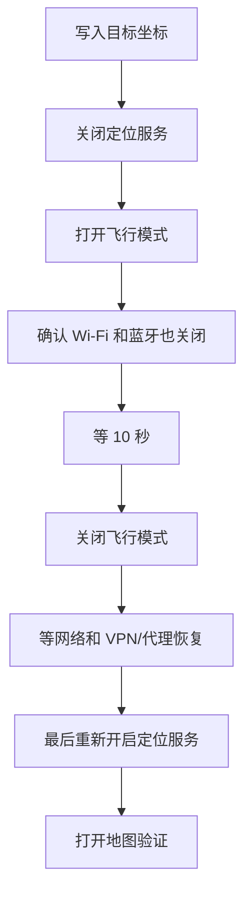

# WLOC 使用指南(面向使用者)

> **本站点**:https://REPLACE-ME.workers.dev/
>
> 前提:部署者已按 [README](../README.md) 把 Worker 部署好。你需要的只是一台 iPhone(或 iPad)和一个代理客户端。

本文只讲**怎么用**。工作原理、部署方式、安全边界见 [README](../README.md) 与 [NOTICE](../NOTICE.md)。

---

## 0. 先确认三件事

**① 系统版本**

```text
设置 → 通用 → 关于本机 → iOS 版本
```

| 你的系统 | 能否使用 |
| --- | --- |
| iOS 27 正式版 / RC | ❌ 苹果已封堵该 MITM 链路,本工具**不支持** |
| iOS 27 beta 6 及以后 | ⚠️ 已知 TLS/MITM 限制,大概率不可用 |
| 更早、且代理客户端能正常 MITM | ✅ 继续往下看 |

> 如果你的设备已经是 iOS 27 正式版,**不要反复重装模块、证书或快捷指令** —— 现象(快捷指令报错、网络连接已中断、网页显示保存成功但地图不变)不是配置错误造成的。

**② 一个代理客户端**:Surge / Quantumult X / Loon / Stash / Shadowrocket 任选其一。

**③ 能打开站点**:在 Safari 里访问上面的「本站点」。打不开的话先解决网络问题,后面的步骤都依赖它。

---

## 1. 完整链路(缺任何一项都不生效)


最常见的情况不是「没装模块」,而是**装了模块但漏了 CA 完全信任**。

---

## 2. 第一步:安装 WLOC 模块

打开 **https://REPLACE-ME.workers.dev/**,页面底部「模块订阅地址」一节列出了全部五种格式,长按复制对应你客户端的那一条:

| 客户端 | 模块地址 |
| --- | --- |
| Surge / Egern | `https://REPLACE-ME.workers.dev/modules/wloc.sgmodule` |
| Quantumult X | `https://REPLACE-ME.workers.dev/modules/wloc.conf` |
| Loon | `https://REPLACE-ME.workers.dev/modules/wloc.lpx` |
| Stash | `https://REPLACE-ME.workers.dev/modules/wloc.stoverride` |
| Shadowrocket | `https://REPLACE-ME.workers.dev/modules/wloc.module` |

各客户端的导入位置大致如下(不同版本菜单名可能略有差异):

| 客户端 | 路径 |
| --- | --- |
| Surge | 模块 → 安装新模块 → 从 URL 安装 → 粘贴地址 → 启用 |
| Quantumult X | 重写 → 引用 → 添加资源 → 粘贴地址 → 启用 |
| Loon | 配置 → 插件 → + → 添加 URL → 粘贴地址 → 安装 → 打开开关 |
| Stash | 覆写 → 添加覆写 → 粘贴地址 → 启用 |
| Shadowrocket | 配置 / 模块 → 添加模块 → URL → 粘贴地址 → 保存并启用 |

> [!WARNING]
> **模块显示「已安装」不代表 WLOC 能用。** 必须继续做第二步。

---

## 3. 第二步:开启 MITM 并完全信任证书(最容易漏)

WLOC 需要解密以下域名的 HTTPS 流量,模块已经把它们写进 MITM 主机名列表:

```text
gs-loc.apple.com
gs-loc-cn.apple.com
gsp-ssl.ls.apple.com
bluedot.is.autonavi.com
bluedot.is.autonavi.com.gds.alibabadns.com
```

**① 在客户端里开启 HTTPS 解密 / MITM**

找到类似 `MITM` / `HTTPS 解密` / `HTTPS Decryption` / `证书` 的设置页,打开总开关。确认主机名列表包含上面几个域名(模块是用 `%APPEND%` 追加的,已装模块就会自动带上)。

**② 生成并安装 CA 证书**

同一页面里生成 CA,然后选择「安装证书 / Install Certificate」。

**③ 在系统里安装描述文件**

```text
设置 → 通用 → VPN与设备管理
```

找到刚下载的描述文件,点击安装并完成。

**④ 打开「完全信任」(这一步最常被漏掉)**

```text
设置 → 通用 → 关于本机 → 证书信任设置
```

找到你的代理客户端生成的 CA,打开「针对根证书启用完全信任」。

> [!IMPORTANT]
> **安装描述文件 ≠ 完全信任证书。**
>
> 没做这一步的典型现象:快捷指令提示「网络连接已中断」、请求失败、Safari 报证书错误、设了坐标没有效果。

完成后回到客户端,确认 **WLOC 模块、MITM、代理 / VPN** 三者都在运行。

---

## 4. 第三步:写入目标坐标

### 方法 A:网页选点(推荐)

1. Safari 打开 **https://REPLACE-ME.workers.dev/**
2. 在地图上点击选点;也可以搜索地名、粘贴地图链接(支持 Apple / Google / 高德 / 百度)、直接输经纬度
3. 需要的话填「扰动半径(米)」——每次定位在目标点周围随机偏移,0 表示关闭
4. 点击 **储存到设备**

页面上的「储存到设备」请求的是 `gs-loc.apple.com/wloc-settings/save`,这个请求由**你手机上的 WLOC 模块拦截并写入本地**,不经过本站点。所以:

> [!IMPORTANT]
> **Safari 必须走当前启用 WLOC 的代理客户端。** 网页显示成功只代表坐标写入完成,不代表系统定位已经改变 —— 还要做第四步。

页面上的「当前生效坐标」可以查看客户端里已保存的值,「清除数据」可以清掉它。

### 方法 B:Apple 地图分享到快捷指令(可选)

需要你自己准备快捷指令,并把里面的解析服务地址改成本站点:

```text
https://REPLACE-ME.workers.dev/api/parse?format=json&u=<地图分享链接>
```

返回 `{"lat":..,"lon":..,"name":".."}`。流程是:Apple 地图选点 → 共享 → 运行快捷指令 → 解析坐标 → 保存到 WLOC。

本站点**不提供**公共快捷指令安装链接,因为快捷指令里写死的地址必须是你的站点。

---

## 5. 第四步:按顺序刷新定位(顺序不能换)

写入坐标后,**必须**按下面顺序操作一遍,系统才会重新拉取网络定位:



具体操作:

1. **关闭定位服务** —— `设置 → 隐私与安全性 → 定位服务`,关掉总开关
2. **打开飞行模式** —— 然后**确认 Wi-Fi 和蓝牙也已经关闭**。iOS 会保留你之前手动开的 Wi-Fi/蓝牙状态,只看飞行模式图标不够:
   - 飞行模式:开
   - Wi-Fi:关
   - 蓝牙:关
   - 定位服务:关
3. **等约 10 秒**,保持上面的状态
4. **关闭飞行模式**
5. **等网络和代理恢复** —— 确认 Wi-Fi/蜂窝已联网、代理客户端已重连、VPN 已连接、WLOC 模块仍启用。**不要这时候急着开定位。**
6. **最后重新开启定位服务**

> [!WARNING]
> 如果在 VPN / 代理还没恢复时先开了定位服务,系统可能先拿到一次未经过 WLOC 的定位结果,看起来就像「设了没用」。

---

## 6. 验证是否生效

1. 确认 VPN / 代理已连接、WLOC 模块仍启用、定位服务已打开
2. **完全退出** Apple 地图(上滑关闭,不是切后台)
3. 重新打开地图,等几秒看蓝点位置

> [!NOTE]
> WLOC 改的是 Apple 的 **Wi-Fi / 基站网络定位结果**,不是 GPS 芯片。
>
> 设备能收到真实 GPS 信号时,系统仍可能用 GPS 覆盖网络定位,于是出现「先跳到虚拟位置,过几秒又回到真实位置」。
>
> 首次测试建议在**室内或 GPS 信号弱**的环境。

---

## 7. 恢复真实位置

用网页上的 **清除数据** 按钮,或运行你自己的清除快捷指令。

清除后建议:

1. 完全退出地图 App
2. 等系统重新获取定位
3. 必要时重启设备

如果清除后仍在虚拟位置,检查是否在模块参数里另外写死了固定的 `longitude` / `latitude` —— 那种情况下仅清除网页保存的数据不够,要么改掉模块参数,要么临时关掉模块。

---

## 8. 常见问题

| 现象 | 最先检查什么 |
| --- | --- |
| iOS 27 正式版用不了 | 系统本身不支持,别重复装证书 |
| 快捷指令「网络连接已中断」 | 系统版本 → MITM 是否开 → CA 是否完全信任 → VPN 是否在跑 |
| 「获取词典值失败」 | 快捷指令里的解析地址是否指向你的站点、是否返回 JSON |
| 网页能打开但「储存」失败 | Safari 是否走代理 → 模块和 MITM 是否生效 |
| 储存成功但地图位置不变 | 系统版本 → CA 完全信任 → GPS 覆盖 → 定位缓存未刷新 → 模块没命中 |
| 过几秒又跳回真实位置 | GPS 覆盖了网络定位,换个室内环境再试 |
| 清除后仍是虚拟位置 | 模块参数里是否有固定经纬度、是否装了重复的旧模块 |
| 模块地址打不开 | 站点是否可访问、客户端能否访问该域名 |

各客户端的具体菜单路径见第 2、3 节。

---

## 9. 遇到问题要提供什么

```text
iPhone 型号:
iOS 完整版本:
代理客户端 + 版本:
WLOC 模块是否启用:
MITM 是否开启:
CA 是否在「证书信任设置」完全信任:
用的是网页还是快捷指令:
具体错误提示:
```

如果是地图链接解析问题,再附上分享出来的原始链接。

**提交前请删掉节点密码、Token、证书私钥、真实坐标等敏感信息。**

---

## 10. 免责声明

本工具仅用于**授权测试、安全研究和 QA 场景复现**。

- 只能测试你自己拥有,或已获得明确授权的设备、应用、账号和网络。
- 你需要自行遵守所在地法律法规、平台规则和服务条款。
- 作者不对任何滥用行为、服务违规、账号封禁、数据损失、法律后果或其他损害负责。
- 本项目按「原样」提供,不提供任何形式的担保。

不要使用本项目欺骗服务、绕过规则、伪造生产环境定位数据,或在未经授权的设备和网络上使用。
