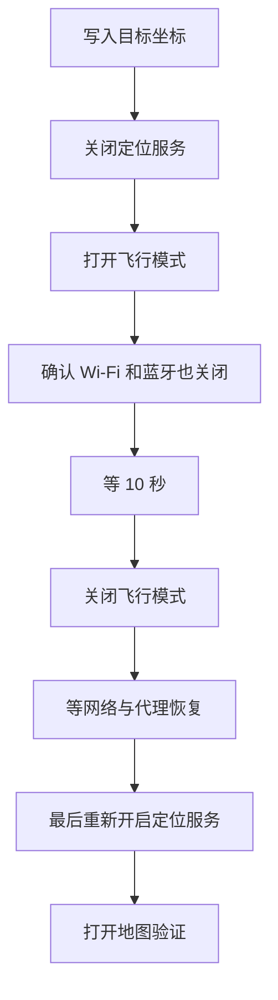

# WLOC 使用指南(免客户端模式)

> **本站点**:{{SITE}}/
>
> 需要准备:一台 iPhone/iPad、一台电脑(和手机同一 Wi-Fi)、一个 Cloudflare Worker 站点(上面这个地址)。

本方案**不需要安装任何代理客户端**(Surge / Quantumult X / Loon / Stash / Shadowrocket),也**不需要安装任何 App**。手机上只装一份「证书 + 描述文件」,改写由你电脑上的引擎完成。

---

## 0. 先确认能不能用

| 检查项 | 说明 |
| --- | --- |
| iOS 版本 | **iOS 27 正式版/RC 不支持**(苹果封堵了该 MITM 链路);beta 6 起有 TLS 限制。更早且网络定位可被 MITM 的系统可用 |
| Wi-Fi | **仅 Wi-Fi 生效**:代理写在描述文件的 Wi-Fi 配置里,用蜂窝数据时不会生效 |
| 电脑 | 需要 Node ≥ 18(引擎零依赖);电脑与手机必须在同一局域网 |

---

## 1. 电脑上启动引擎(首次配置一次,之后每次使用前启动)

```sh
cd engine
bash tools/make-certs.sh          # 首次:生成根证书与服务端证书(需要 openssl)
cp config.example.json config.json
```

编辑 `config.json`:

| 字段 | 填什么 |
| --- | --- |
| `serverHost` | **你电脑的局域网 IP**(如 `192.168.1.100`)——手机要通过它连到引擎 |
| `ssids` | 你 Wi-Fi 的名字;可带 `password` 字段(填了会写进描述文件) |
| `proxyPort` | 默认 `8888`,一般不用改 |
| `adminHost` | 默认 `127.0.0.1`;**手机要装描述文件时改成 `"0.0.0.0"`**,装完改回 |

```sh
npm start
```

启动后会打印监听地址与建议填写的手机端代理地址。管理页:`http://<电脑IP>:18080/`。

> [!WARNING]
> 引擎的 `8888` 端口**不要暴露到公网** —— 代理没有鉴权,暴露会成为开放中继。只在可信局域网内使用。

---

## 2. 手机安装描述文件

1. 手机连上那个 Wi-Fi,用 **Safari** 打开 **{{SITE}}/**
2. 页面底部「免客户端模式」卡片里,展开「生成描述文件」
3. 填入:电脑局域网 IP、端口(默认 8888)、Wi-Fi 名称、Wi-Fi 密码(可空)
4. **根证书已由本站自动载入**(页面会显示 SHA-256 指纹),无需手动传文件
5. 点「生成描述文件并下载」→ 系统提示下载完成
6. 设置 → 通用 → **VPN与设备管理** → 安装刚下载的描述文件

> [!NOTE]
> 本站分发的根证书来自仓库 `public/ca.cer`(由 `engine/tools/make-certs.sh` 同步),**只有证书、没有私钥**。若你重新生成过证书,必须重新运行 `npm run configure` 并提交,否则站点发的是旧证书,手机装完会连不上引擎——页面上的指纹可用于核对是否与 `engine/certs/ca.crt` 一致。指纹对不上时,可在页面上手动指定证书。

### 7. 打开「完全信任」(最容易漏的一步)

设置 → 通用 → 关于本机 → **证书信任设置** → 找到根证书(**名称显示为 `selfhost-wloc Root CA`**)→ 打开**完全信任**。

> [!IMPORTANT]
> **安装描述文件 ≠ 完全信任证书。** 漏掉这一步的典型现象:请求失败、地图不变、提示网络中断。

装好后回到「设置 → 无线局域网」,点当前 Wi-Fi 右侧的 ⓘ,确认底部 **配置代理 = 自动**,网址是页面上显示的那条 **PAC 网址**(形如 `https://<你的站点>/wloc.pac`)。如果没生效,手动重连一次该 Wi-Fi。

> [!IMPORTANT]
> **用「自动(PAC)」,不要用「手动」。**
>
> 手动代理是**全局**的:一旦填上,该 Wi-Fi 上的所有流量都会被送到那台电脑。引擎开着时没问题(它会把其它网站透传),但**引擎没开时你整个网络都会卡死甚至断网**。
>
> PAC 只把三个定位域名送进电脑、其余全部直连,并且**带回退** —— 引擎没开时定位请求自动直连,其它上网完全不受影响。

> [!NOTE]
> **PAC 网址里没有 IP。** 电脑地址填在站点仓库的 `project.config.json` 里(`engineHost`),推送后自动生效 —— 也就是说**电脑换地址时只改那一处,手机端什么都不用动**。
>
> 想临时换地址又不想重装,可以在手机「自动代理」的网址后面加参数:`<站点>/wloc.pac?h=新地址&p=端口`。

> [!WARNING]
> 引擎的 `8888` 端口**不要暴露到公网** —— 代理没有鉴权,暴露会成为开放中继。只在可信局域网内使用。

---

## 3. 选点并写入

1. 在 **{{SITE}}/** 上选位置:点地图、搜地名、粘贴地图链接(Apple/Google/高德/百度均可)、或直接输经纬度
2. 需要的话填「扰动半径(米)」——每次定位在目标点周围随机偏移,0 表示关闭
3. 点 **储存到设备**

这个请求打向 `gs-loc.apple.com/wloc-settings/save`,由**引擎**拦截并写入坐标(不经过本站点)。页面上的「当前生效坐标」可以查看已保存的值,「清除数据」可以清掉。

> [!NOTE]
> 网页显示成功只代表坐标已写入,**不代表系统定位已经改变** —— 还要做下一步。

---

## 4. 刷新定位(顺序不能换)



1. **关闭定位服务**:设置 → 隐私与安全性 → 定位服务 → 关
2. **打开飞行模式**,并确认 **Wi-Fi 和蓝牙也真的关了**(iOS 会保留你之前手动开的 Wi-Fi/蓝牙状态)
3. **等约 10 秒**
4. **关闭飞行模式**
5. **等网络恢复**:确认 Wi-Fi 已连上、ⓘ 里代理仍指向 PAC 网址、引擎仍在运行。**不要这时候急着开定位**
6. **最后重新开启定位服务**

> [!WARNING]
> 网络/代理还没恢复就开定位,系统可能先拿到一次未经过 WLOC 的结果,看起来就像「设了没用」。

---

## 5. 验证

1. 看**引擎终端**:是否有 `[proxy] MITM gs-loc...` 之类的日志
   - **没有日志** = 定位请求根本没走代理,说明 iOS 的 `locationd` 不遵循 Wi-Fi 手动代理 → 本方案在你的系统上不可用(此时只能改用代理客户端模块或 `wloc8` App 路线)
   - **有日志** = 链路通了,继续下一步
2. 完全退出地图 App(上滑关闭),重新打开,等几秒看蓝点

> [!NOTE]
> 改的是 Apple 的 **Wi-Fi / 基站网络定位结果**,不是 GPS 芯片。能收到真实 GPS 时系统会用 GPS 覆盖,于是出现「先跳到虚拟位置,过几秒又回真实位置」。首次测试建议在**室内或 GPS 信号弱**的环境。

---

## 6. 恢复真实位置

1. 页面上点 **清除数据**,或在引擎管理页执行 `?action=clear`
2. 建议:完全退出地图 App → 等系统重新定位 → 必要时重启设备

彻底停用:设置 → 通用 → VPN与设备管理 → 删除该描述文件(同时移除代理与证书)。

---

## 7. 常见问题

| 现象 | 先检查什么 |
| --- | --- |
| iOS 27 正式版无效 | 系统封堵,三种路线都无效,别反复装证书 |
| 页面能开但「储存」失败 | 引擎是否在跑、手机是否同一 Wi-Fi、ⓘ 里 HTTP 代理是否指向电脑 |
| 引擎日志里完全没有 gs-loc | `locationd` 不走该代理 → 本方案不可用 |
| 有日志但地图位置不变 | 是否已「完全信任」CA、是否按第 4 步顺序刷新、GPS 是否覆盖网络定位 |
| 一直提示网络中断 | 描述文件里的代理地址/端口不对,或引擎已停止 |
| 过几秒跳回真实位置 | GPS 覆盖了网络定位,换室内环境再试 |
| 描述文件装不上 | 用 Safari 打开(不是微信内置浏览器);文件名应为 `wloc.mobileconfig` |
| 出门就失效 | 正常 —— 仅 Wi-Fi 生效 |

---

## 8. 安全须知

- 描述文件里的 CA **只信任你自己的根证书**;私钥(`engine/certs/ca.key`)只留在你电脑上,不要外发、不要提交到 git。
- **描述文件不要给别人装**:那会把别人的 Wi-Fi 流量代理到你的电脑。
- 只在**自己拥有或已获授权**的设备上测试。详见站点仓库的免责声明。
